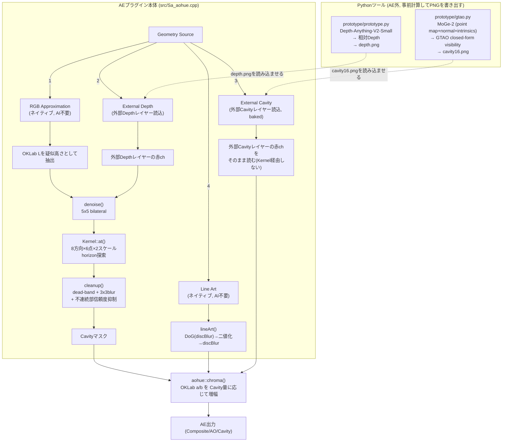

# Sa_aohue パイプライン解説(廃止・履歴)

**この文書は2026-09-07時点の旧構成(Geometry Source 4種)を記録したものです。その後`Line Art`単体に一本化し、RGB Approximation/External Depth/External Cavity(MoGe-2+GTAO・Depth Anything V2)はプラグイン本体から削除しました。現行の構成はREADME.mdを参照してください。** 以下は削除前の設計判断・実写真比較の記録として残しています。

---

現状(2026-09-07時点)の全体構成の説明。README.mdの補足で、「今どういう経路でCavityが作られてAEに渡るか」を一枚で追えるようにする。

## 1. 全体像

Sa_aohueは「Cavity(局所閉塞度, 0〜1)」というグレースケールのマスクを何らかの方法で作り、それをOKLab色空間でChromaを増やす処理(`aohue::chroma`, `src/core.h` / `prototype/prototype.py`の`chroma`)に渡す、という構造は一貫している。

**Cavityの作り方が4通り**あり、AEの`Geometry Source`ポップアップで切り替える。



**以降の各節で使う実写真テスト用の入力画像(`image.png`, 1920x1080, ユーザー提供):**


## 2. 4つのGeometry Source

### 2-1. RGB Approximation (source=1) — ネイティブ, AI不要

外部ファイル一切不要。元のRGBそのものから疑似的な「高さ」を作ってCavity計算する唯一の完全自己完結モード。

1. 元RGBをsRGBデコード → OKLabのL(明度)を取る。これを「疑似高さ」として使う。影・黒い模様と本当の凹凸は区別できない(色の情報だけなので当然)。
2. `denoise()`: 5x5 bilateral(range+spatial重み)でこのL場を平滑化。深度差が大きい所(≒本当のエッジ)は跨がずに、細かいノイズだけ除去。
3. `Kernel::at()`: 8方向×各6点×2スケール(Radius / Radius×0.25)でhorizon(遮蔽物の稜線)を探索。反対方向の幾何平均を取って片側だけの応答を抑制。`Contrast`で`Cavity^(1/Contrast)`のガンマ補正。
4. `cleanup()`: 出てきたCavityマスクに対し、dead-band(閾値0.025)以下を切り捨てて再正規化 → 3x3ブラーで平滑化 → 5x5窓内のDepth最大最小差が大きい(=急な輪郭)所は信頼度を下げて抑制。

**今回判明した問題**: ステップ3の後、実写真・実イラストではContrast=1(既定)だと画面全体に薄いノイズ状のCavityが乗る(2026-09-07、アニメスクリーンショットで再現・実証済み。詳細は5章「現状のオープンな課題」参照)。Contrastを0.2〜0.3程度に下げると大幅に軽減する。

**実写真での比較(`image.png`, 1920x1080, 実際にユーザーから提供された画像。すべて`render<PF_Pixel8>`を直接叩いた実出力):**

| Cavity (Contrast=1, 既定) | Cavity (Contrast=0.3) |
|---|---|
|  |  |

| Composite (Contrast=1, 既定) | Composite (Contrast=0.3) |
|---|---|
|  |  |

Contrast=1のCavityは画面全体が薄い粒状ノイズで覆われている(ぼかし背景の平坦部にも出ている点に注目)。Contrast=0.3では髪の生え際の本物の接触陰影だけが残る。

### 2-2. External Depth (source=2)

外部の「Depth」レイヤー(赤チャンネル、白=手前)を読み込み、RGB Approximationと同じ`denoise → Kernel → cleanup`にかける。`Invert Depth`で白黒反転。Depth自体は外部(Pythonの`prototype.py`など)で用意する。

**実写真での比較(`image.png`にレガシーDepth-Anything-V2の推定Depthを適用):**

| Cavity, 8bpc精度(旧テスト) | Cavity, 16bpc精度(正しい比較) |
|---|---|
|  |  |

**重要な発見(2026-09-07)**: 左は検証用にDepthを8bit精度へ落として`render<PF_Pixel8>`(AEの8bpcプロジェクト相当)に通した結果。等高線のような同心円状のノイズが画面全体に出る。右は同じDepthを8bit精度へ落とさず`render<PF_Pixel16>`(16bpc相当)に通した結果で、このノイズは完全に消える。

原因は`Kernel`の`zscale`(`min(w,h)*.5`、この画像で約540)が、Depthの量子化1段(1/255 ≈ 0.4%)を「高さ540×0.004 ≈ 2.1」相当まで増幅してしまうこと。この値はslopeのしきい値0.025を軽々超えるため、8bit精度のDepthでは量子化の段差そのものが等高線状の偽Cavityとして検出される。**AEプロジェクトが8bpcの場合、External Depth/RGB Approximationは特にこの影響を受けやすい。** 16bpc以上のプロジェクト・素材を推奨する根拠がここにある。

| Composite, 16bpc精度 |
|---|
|  |

### 2-3. External Cavity (source=3) — baked, Kernelバイパス

外部の「Cavity」レイヤー(赤チャンネル、既に0〜1のCavity値)をそのまま読む。`denoise`も`Kernel`も`cleanup`も一切通らない。Contrastのガンマ補正と`Invert Depth`(=`1-Cavity`)だけがここで適用される。

品質優先経路である**MoGe-2 + GTAO**(`prototype/gtao.py`)は、ここに焼き込み済みの`cavity16.png`を流し込む形で使う。C++側は無改修でこの経路をそのまま使える。

**実写真での比較(`image.png`にMoGe-2+GTAOの`cavity16.png`を適用, 960x540, --radius 0.5m):**

| Cavity | Composite |
|---|---|
|  |  |

こちらはbaked path(Kernel/denoise/cleanup非経由)なので8bit量子化の増幅問題は起きない(`cavity16.png`自体が既に16-bit精度でPython側から書き出されているため)。normalベースなので髪の毛一本一本の陰影まで拾えている。

### 2-4. Line Art (source=4) — ネイティブ, AI不要, 新規

2026-09-07追加。幾何・奥行きを一切見ない、イラスト的な擬似AO。ユーザー判断により現状の推奨経路。`discBlur`・`denoise`・`cleanup`の行方向ループは`aohue::parallelFor`(`std::thread::hardware_concurrency()`、最大16、行範囲分割)でマルチスレッド化済み。実写真1920x1080・Radius=256(Vogel 256点)で約626ms(24コア環境の実測、`tests/render_bridge.cpp`経由)。

1. OKLab LからDifference of Gaussians(`discBlur`半径1px・1.6pxの差)で線を検出。
2. しきい値(`Edge Protect`スライダーを流用、0〜100 → 0〜0.03、既定50=0.015)で二値化。`Invert Depth`でどちら側を線とみなすか切替。
3. 二値化した線を`Radius`(既定24px)でぼかし、`Contrast`でガンマ補正。これがそのままCavity。

**実写真での比較(`image.png`, しきい値=Edge Protect 10/30/50/80):**

| 10 | 30 | 50 | 80 |
|---|---|---|---|
|  |  |  |  |

値を上げるほど弱い勾配を無視するようになり、検出される線が減る(Cavity平均: 8.96→3.67→2.21→1.11, 0-255スケール)。

`discBlur`(`cool_blur/plugin/CoolBlur_Core.h`の`gather_channel()`移植)をDoGの小カーネルと最終段のRadiusぼかし両方に使う。小半径(169-tap閾値、約6px)は厳密円盤平均、それ以上は`vogel_pattern()`(golden-angle螺旋、64/128/256点)移植のサンプリングに自動切替。旧版は最終段だけbox blur(SAT)だったが、角ばった見た目だったため2026-09-07に円形サンプリングへ統一した。

**実写真での比較(`image.png`, Radius=24とRadius=6):**

| Cavity, Radius=24(既定) | Cavity, Radius=6 |
|---|---|
|  |  |

| Composite, Radius=24(既定) | Composite, Radius=6 |
|---|---|
|  |  |

幾何を見ないので他3経路と違い量子化増幅の問題は起きない(DoGの差分はどちらも同じ8bit RGBから取っているが、`zscale`のような巨大な倍率を掛ける工程がそもそも無い)。Radius=24は線を広く滲ませたソフトな効果、Radius=6は線そのものに近いシャープな効果。

## 3. 外部Pythonツール(AEの外で事前計算するもの)

AE本体はAI推論をしない。品質優先の経路は、Python側で重い処理をしてPNGを書き出し、それをAEの外部レイヤーとして読ませる。

| ツール | モデル | 出力 | AEでの受け口 |
|---|---|---|---|
| `prototype/gtao.py`(新, 推奨) | MoGe-2 ViT-B normal付き(104M, MIT) | `cavity16.png`(GTAO visibilityから計算したCavity) | `Geometry Source=External Cavity` |
| `prototype/prototype.py`(旧) | Depth-Anything-V2-Small(24.8M, Apache-2.0) | `depth.png`(相対Depth) | `Geometry Source=External Depth` |

### 3-1. `gtao.py`: MoGe-2 + GTAO

1. MoGe-2推論で **metric point map**(カメラ座標のx=right/y=down/z=forward)・**normal**・**camera intrinsics**を得る。相対Depthではなく実スケールの3D座標。
2. `--normal-blur`(既定6px)でnormalに`disc_blur`(`cool_blur`移植、円形平均)をかけて再正規化。※ブロックノイズ調査で追加したが主因ではなかった。無害なので残置。
3. 各pixel・各slice方向(既定9)でnormalをslice平面へ投影し符号付き角度`n`を得る。
4. 両側・各既定8点、実3D位置をbilinearサンプリングしてhorizon cosineを探索。探索半径はmetric単位(既定0.5m)をintrinsicsでpixel換算するので、画像の解像度・フレーミングに依存しない。
5. 閉形積分`Iarc(h,n) = (cosN + 2h·sin(n) - cos(2h-n))/4`(GameTechDev/XeGTAOの`XeGTAO.hlsli` MainPass移植)でcosine重み付き可視性を解析的に評価。
6. `Cavity = 1 - visibility`。`chroma()`でOKLab Chroma増幅、`cavity16.png`書き出し。

### 3-2. `prototype.py`: Depth Anything V2 Small + horizon法(旧)

1. Depth-Anything-V2-Smallで相対Depth推定、1/99パーセンタイルで0〜1正規化。
2. `denoise()`(core.hと同じ式をNumPyで再実装)でbilateral平滑化。
3. `cavity()`: core.hの`Kernel::at()`と同じ8方向×6点×2スケールのhorizon探索(NumPyベクトル化版)。
4. `cleanup()`(core.hと同じ式)で後処理。
5. `chroma()`でOKLab Chroma増幅。`depth.png`・`cavity.png`等を書き出し。

`tests/check_native.py`が、この`cavity()`/`chroma()`とC++の`Kernel::at()`/`aohue::chroma()`を数値比較して一致を検証している(生のアルゴリズムのみ。denoise/cleanupはこの比較の対象外)。

## 4. パラメータがどの経路で効くか

| UI | RGB Approx | External Depth | External Cavity | Line Art |
|---|---|---|---|---|
| Radius | 探索半径 | 探索半径 | 無効(焼き込み済み) | 二値化後のブラー半径 |
| Contrast | `Cavity^(1/C)`ガンマ | 同左 | 同左 | 同左 |
| Detail | 2スケール混合比 | 同左 | 無効 | 無効 |
| Edge Protect | 大きなDepth差を抑制 | 同左 | 無効 | 無効 |
| Invert Depth | Lを反転 | Depthを反転 | `1-Cavity` | DoGのどちら側を線とみなすか |
| Depth Layer | 未使用 | Depth入力 | Cavity入力 | 未使用 |
| RGB Encoding | sRGB/Linear切替 | 未使用(externalは常にunit) | 未使用 | RGB Approxと同じ |

## 5. 現状のオープンな課題(2026-09-07)

- **RGB Approximation / External Depthの粒状ノイズ**: Contrast=1(既定)で、実写真・実イラストの平坦な領域にも薄いCavityが画面全体に乗る。実際のアニメスクリーンショットで再現・実証済み(`results/blocknoise_comparison.png`)。Contrastを下げる(0.2〜0.3)と大幅軽減するが、根本対処(`cleanup()`のdead-band強化など)は未着手・要判断待ち。
- **`zscale`によるノイズ増幅(訂正・確定, 2026-09-07)**: `Kernel`の`zscale`が画像サイズ由来の大きな倍率(この解像度で約540)を持つため、slopeしきい値0.025を軽く超える程度の微小な明度変動が全て偽Cavityとして検出される。2-2節の16bpc実験(8bit量子化を人為的に作った検証)で再現・解消は確認したが、**その後`image.png`本体を直接調べたところ、平坦に見える背景領域(ぼかし部)にも既に標準偏差9/255・隣接画素差最大8程度のノイズ(圧縮由来かフィルムグレイン)が乗っていることが判明**。つまり量子化ステップだけでなく、素材に元々含まれる微小ノイズも同じ機構でそのまま増幅される。8bpc限定の問題ではなく、**ノイズを含む実写真・実素材全般で起きる**、より一般的な感度の高さが本質。恒久対処は、`denoise()`のbilateral強度または`cleanup()`のdead-band(現状0.025固定)を強める案が有力だが未着手。
- MoGe-2のmetric scaleは単眼推定で実寸の正確性は保証されない。
- Line ArtのDoGしきい値・カーネル半径は固定値。
- 詳細な既知の問題一覧はREADME.md 7章を参照。

## 6. ファイルマップ

```
src/core.h              SDK非依存の共通処理: OKLab chroma, Field, denoise, cleanup,
                         Kernel(horizon探索), discBlur(円盤/Vogel螺旋), lineArt, parallelFor(マルチスレッド)
src/Sa_aohue.cpp         AEプラグイン本体: パラメータ定義, 4経路の分岐, SmartFX
prototype/gtao.py        MoGe-2 + GTAO (品質優先, 新)
prototype/prototype.py   Depth-Anything-V2 + horizon法 (旧, フォールバック用に維持)
prototype/download_moge.py / download_model.py   モデル取得(リビジョン固定)
prototype/check_gtao.py / check.py                合成/実写真テスト
tests/check_native.py    core.hのKernel/chromaとprototype.pyの数値一致テスト
tests/check_ae.cpp       AE無しでrender()パイプライン全体をテスト(Line Art含む)
```
